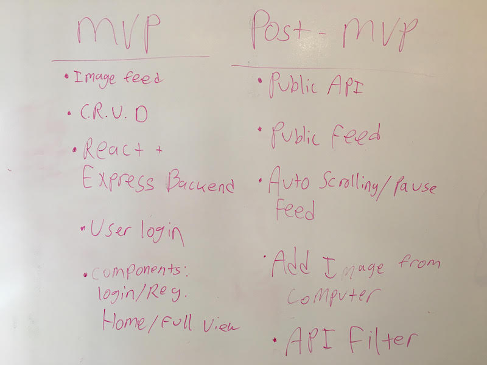
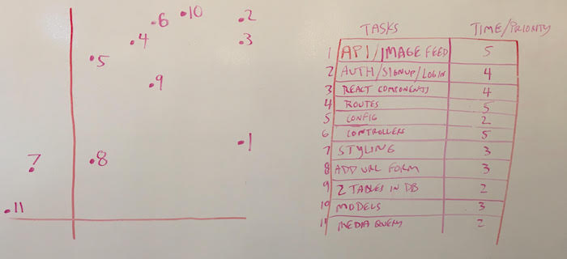

# Project #3: Building Your Own React App & Express API

## Team Members
- Matt Bowe
- Jason Green
- Krista Triviso

#### Table of Contents

- [Technical Requirements](#technical-requirements)
- [Necessary Deliverables](#necessary-deliverables)
- [Suggested Ways to Start](#suggested-ways-to-start)
- [Before You Start](#before-you-start)
- [Project Timeline](#project-timeline)
- [Feedback & Evaluation](#project-feedback--evaluation)
- [Note on Plagiarism](#a-note-on-plagiarism)

## Overview

You’ve already worked in small groups to accomplish various labs and exercises, but, this time, **we’re going to challenge you to work on a whole project with a small team.**

Not only will you be asked to **exercise additional creativity** in designing your project, but your instructors will also partner you with other classmates to architect, design, and collaboratively build an API of your design.

**This is meant to push you both technically and collaboratively.** Working in a team can be more challenging than working by yourself, but you're most likely going to find yourself working in a development team in your first job after WDI, and **it's important to learn how to work together.**

Make it work, and make it awesome.

## Technical Requirements

You must:

- **Use Postgres (pg-promise) & Express** to build an API and a **React** front-end that consumes it
- **Create an Express API using, at minimum, two related models**
- Include **CRUD functionality** in a **RESTful API** for at least one of those models
- **Consume your own API** by making your front-end with React
- **Craft thoughtful user stories together**, as a team
- **Manage team contributions and collaboration** using a standard git workflow on GitHub
- **Designate one team member** to be in charge of managing team git workflow (the Git Dictator)
- Layout and style your front-end with **clean & well-formatted CSS**
- **Deploy your application online** so it's publicly accessible
- **Auth**: A login/logout system
- **Third-Party API**: Use a third-party API, either from the frontend or the backend (if it has a key, it should be from the backend)

## Necessary Deliverables

- A **working API, built by the whole team**, hosted somewhere on the internet
- A handmade front-end **that consumes your own API**, hosted somewhere on the internet
- A **link to your hosted working app** in the URL section of your Github repo
- A **team git repository hosted on Github**, with a link to your hosted project, and frequent commits from _every_ team member dating back to the _very beginning_ of the project
- **A ``readme.md`` file** with:
    - Explanations of the **technologies** used
    - A couple of paragraphs about the **general approach you took**
    - **Installation instructions** for any dependencies
    - Link to your ERDs - Diagrams of your models and their relationships
    - Link to your **user stories** – who are your users, what do they want, and why?
    - Link to your **wireframes** – sketches of  views and interfaces in your application
    - Descriptions of any **unsolved problems** or **hurdles** your team had to overcome

## Project Timeline

The schedule below reflects the required deadlines and was used to keep track of developer progress to align with expectations.

| Day         | Deliverable                             |
| ----------- | --------------------------------------- |
| Day 1: Sun  | Wireframes and Priority Matrix          |
| Day 2: Mon  | Game / Express Server / React framework |
| Day 3: Tues | Express Server / React framework        |
| Day 4: Wed  | API / Models / clickable prototype      |
| Day 5: Thur | Routes and controller                   |
| Day 6: Fri  | Views                                   |
| Day 7: Sat  | Updating database from font-end         |
| Day 8: Sun  | User data rendering in React            |
| Day 9: Mon  | Bugs                                    |     
| Day 9: Mon  | Presentation                            |            

## Project Feedback + Evaluation

See the [RUBRIC.md](./RUBRIC.md) for evaluation details.

## Submission

**ONE** issue Ticket on this repository where the title includes names of **ALL** contributors!
 [Final Version](https://git.generalassemb.ly/Rover6team/nasagram)

 ## Wireframes

 ## MVP / Post-MVP

 ## Priority Matrix

## Components

Based on the initial logic defined in the wireframes, the application is broken down into modular components.

| Components  | Description                                                           |
| ----------- | --------------------------------------------------------------------- |
| Sign-in     | Signing in an Authorized User and redirecting to User Feed            |
| Register    | Adding a new user to the data base and redirecting to User Feed       |
| Public View | Displays the public API without use of saving images                  |
| User View   | Displays the public API with User Feed and all app functionality      |
| API Feed    | NASA API displays images and descriptions                             |
| User Feed   | Displays all images and descriptions the user has saved               |
| Add Footer  | Allows for custom image upload with description                       |

## User Story

### Sign-in Page

When the app is loaded, the user will see a page that states the following:

-   The user will be asked to Sign-in
-   If the user is not registered, they will be redirected to Register form
-   Once the user is authorized, they will be redirected to the home page

### Home Page

When an authorized user is authenticated, the user will see a page that states the following:

-   The left side of the page will display the public NASA API images
-   The right side of the page will display all saved images based on the user
-   The user will be able to delete and edit saved images
-   The bottom of the page will allow for custom user input for a saved image with any URL
-   The top of the page will display the user's name and log-in/out capabilities

### Public Page

When the application is viewed by a guest, the guest will see a page that states the following:

-   The page will display the public NASA API images
-   The guest will not be able to save,  delete or edit images
-   The top of the page will display log-in/out capabilities

## Issues and Resolutions
The API takes a really long time to load all the images, we had to install an npm package called reat-loading to set up a loading animation while the page waits to render completely. This github was very helpful in the process...https://github.com/fakiolinho/react-loading

ERROR:
RESOLUTION:
